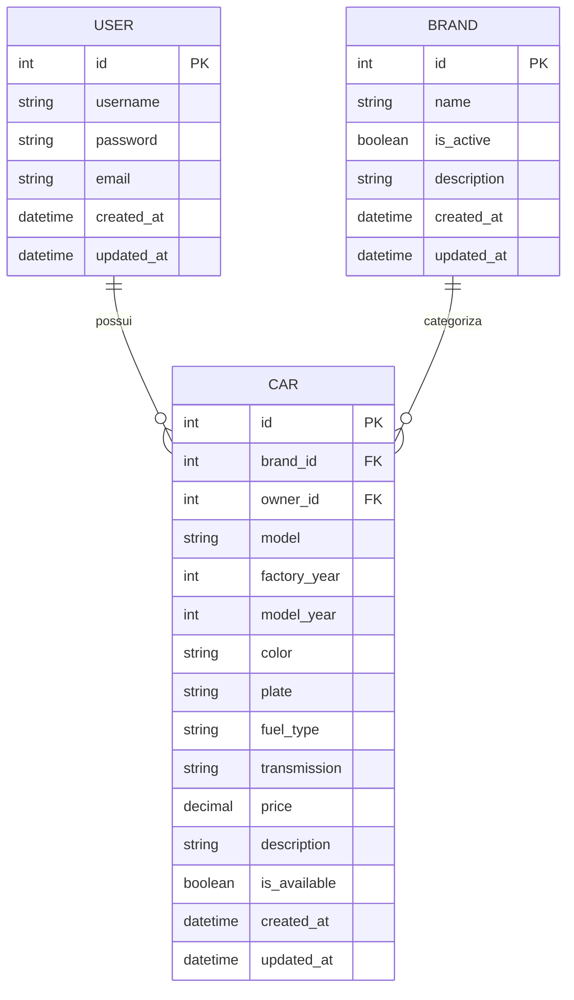
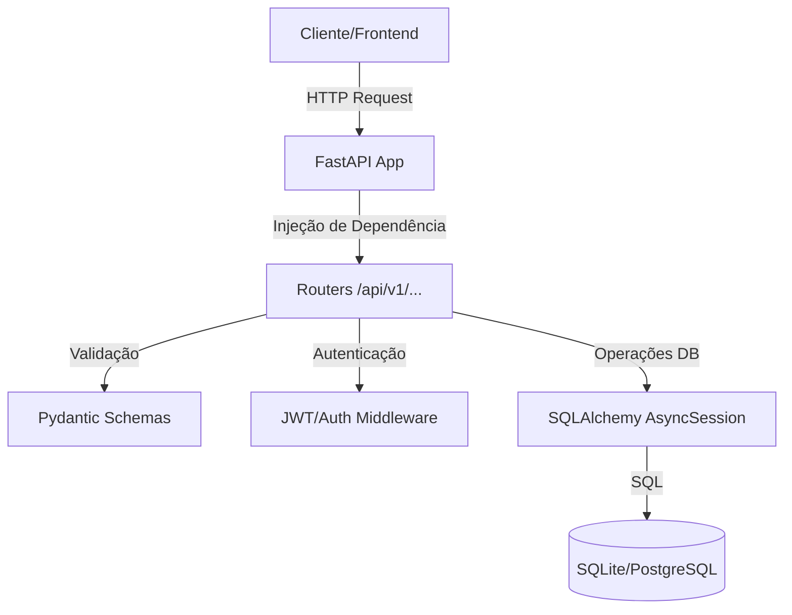
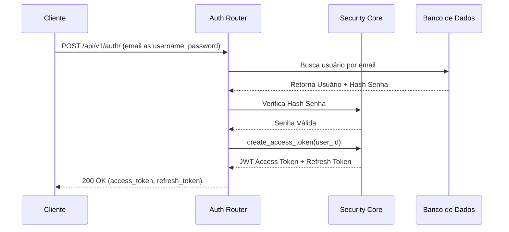
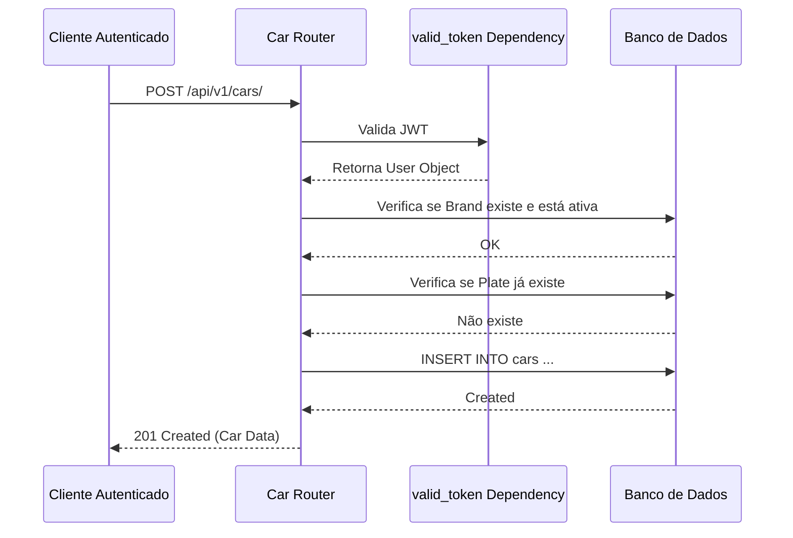
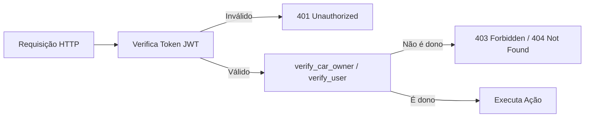

# Modelagem do Sistema

Esta seção apresenta a modelagem técnica da **Car API** utilizando diagramas Mermaid.

## Modelos de Dados (ERD)
O diagrama abaixo representa a estrutura das tabelas no banco de dados e seus relacionamentos.

## Arquitetura do Sistema
A API segue uma arquitetura multicamadas baseada em FastAPI.

## Fluxo de Autenticação
Processo de obtenção e validação do token JWT.

## Fluxo CRUD de Carros
Exemplo de criação de um novo veículo com validações.

## Fluxo de Segurança
Como protegemos os recursos de acesso não autorizado.

